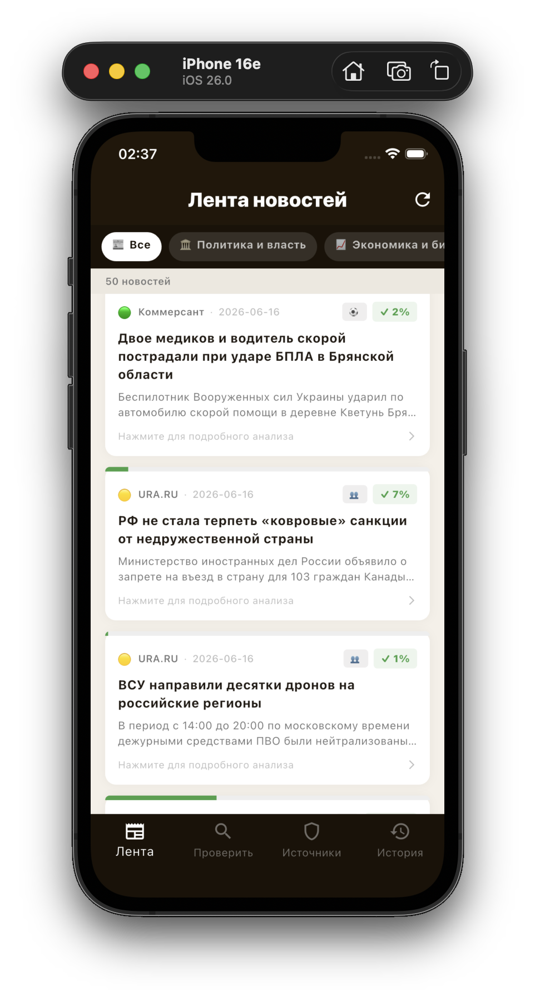
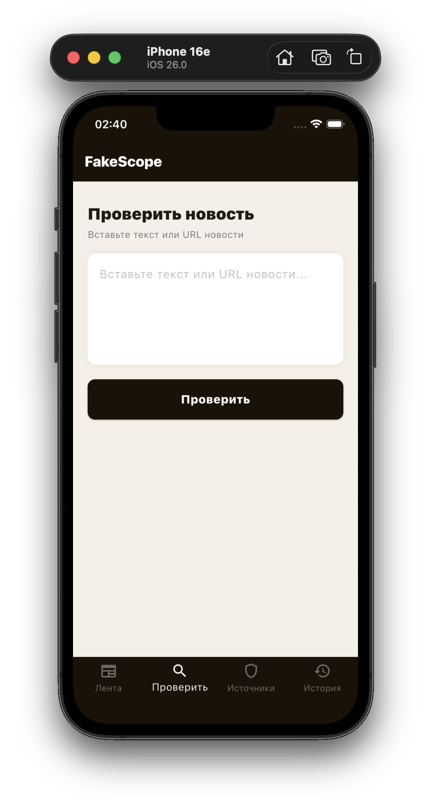
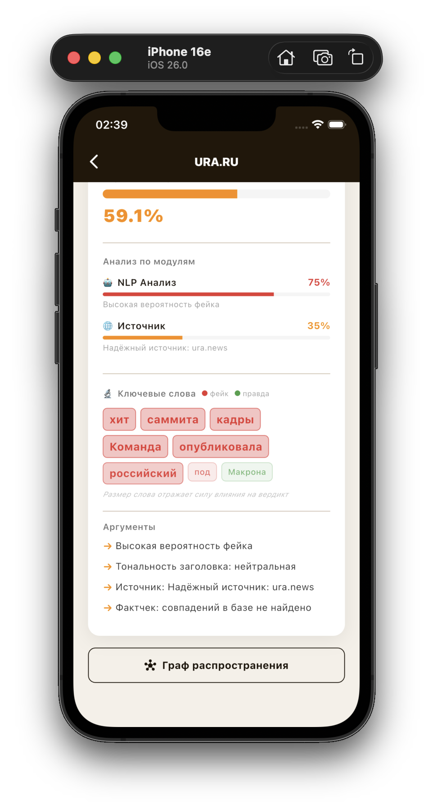
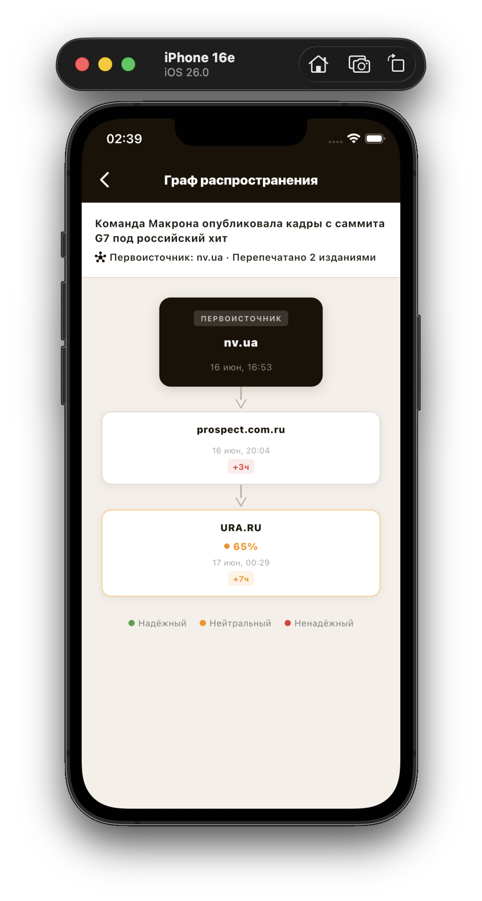
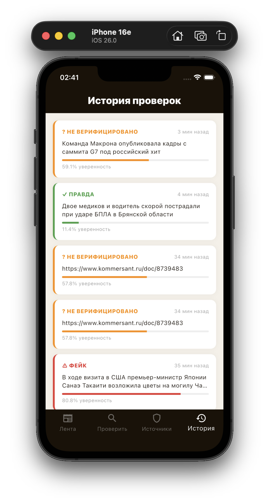
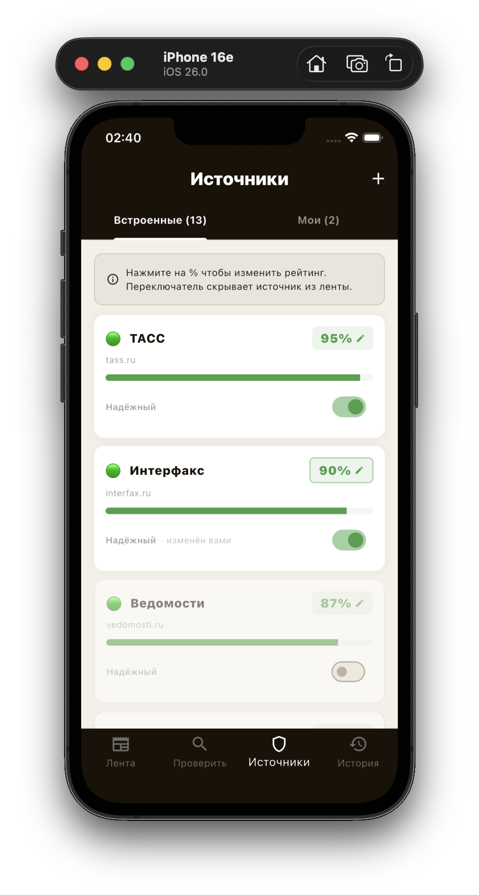
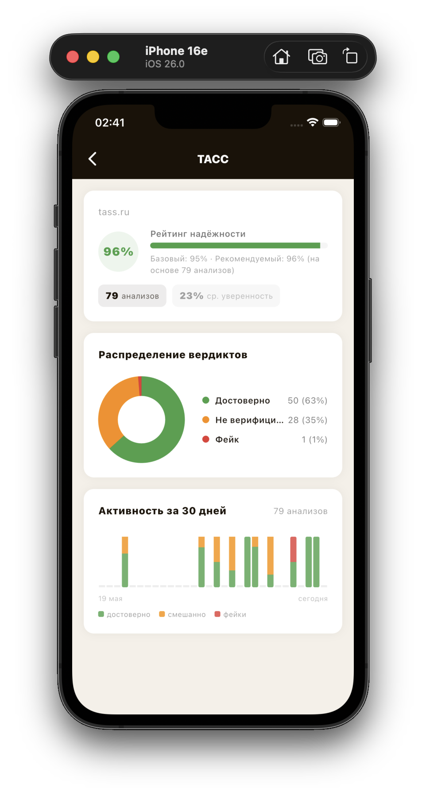

<p align="center">
  
</p>

<h1 align="center">FakeScope</h1>
<p align="center">Система автоматической оценки достоверности русскоязычных новостей</p>

<p align="center">
  
  
  
  
</p>

---

## О проекте

FakeScope — мобильная система автоматической оценки достоверности русскоязычных новостей. Приложение анализирует текст или URL новости сразу по четырём независимым модулям и выдаёт итоговый вердикт с объяснением.

Поддерживает ручную проверку (текст / URL), автоматическую ленту из RSS-источников, граф распространения новости по СМИ и аналитику по доменам.

---

## Скриншоты

<p align="center">
  
  
  
  
  
</p>

<p align="center">
  
  
</p>

---

## Как это работает

Каждая новость проходит через четыре независимых модуля, результаты которых объединяет Fusion Aggregator:

### 1. NLP-модуль
Дообученная модель [`SmuziVPyze/fakescope-rubert`](https://huggingface.co/SmuziVPyze/fakescope-rubert) на базе RuBERT классифицирует текст как фейк или правду. Дополнительно анализируются кликбейтность и тональность заголовка. XAI-компонент подсвечивает ключевые слова, повлиявшие на вердикт.

### 2. Фактчек
Запрос к Google Fact Check Tools API + поиск по локальной базе из 1890 проверенных материалов Лапши Медиа через векторный индекс FAISS.

### 3. Анализ источника
База российских новостных доменов с базовым рейтингом доверия. Рейтинг динамически корректируется на основе истории анализов: фейк у надёжного источника штрафует его сильнее.

### 4. Граф распространения
Поиск по Google News RSS выявляет кто опубликовал новость первым и как она распространялась по СМИ. Похожесть текстов определяется через косинусное сходство эмбеддингов.

---

## Вердикт

| Скор | Вердикт |
|---|---|
| < 35% | ✅ Правда |
| 35–65% | ⚠️ Не верифицировано |
| > 65% | 🚨 Фейк |

---

## Модель

| Параметр | Значение |
|---|---|
| Базовая модель | `DeepPavlov/rubert-base-cased` |
| Датасет | 8 861 примеров (баланс 1:1) |
| Источники фейков | Лапша Медиа (1890), Панорама (2541) |
| Источники правды | Интерфакс, РИА, Коммерсантъ, Ведомости (4430) |
| Точность (random split) | 90.08% |
| F1-score | 0.9007 |
| HuggingFace | [`SmuziVPyze/fakescope-rubert`](https://huggingface.co/SmuziVPyze/fakescope-rubert) |

---

## Стек

**Бэкенд**
- Python + FastAPI
- PostgreSQL + Redis
- Docker Compose

**ML / NLP**
- `SmuziVPyze/fakescope-rubert` — классификатор достоверности
- `SmuziVPyze/fakescope-clickbait` — классификатор кликбейта (F1=0.904)
- `seara/rubert-tiny2-russian-sentiment` — тональность
- `cointegrated/rubert-base-cased-nli-threeway` — классификация тем
- FAISS — векторный поиск по базе фактчеков
- `sentence-transformers/paraphrase-multilingual-MiniLM-L12-v2` — граф распространения

**Мобильное приложение**
- Flutter (iOS + Android)
- Riverpod + Dio

---

## Запуск

### Требования
- Docker + Docker Compose
- Flutter SDK

### Необходимые токены
Для работы системы потребуется получить:
- **Google Fact Check Tools API** — [console.cloud.google.com](https://console.cloud.google.com)


Создай файл `.env` в корне проекта и пропиши ключи. Ф

### Локально

```bash
# Бэкенд
cd ~/Desktop/fakescope && docker compose up -d

# Flutter (симулятор)
cd flutter_app && flutter run

# Flutter (реальное устройство)
flutter run --release -d <device_id>
```

---

## API

```
POST /api/analyze                  — анализ текста или URL
GET  /api/history                  — последние 20 проверок
GET  /api/feed                     — лента новостей
GET  /api/graph                    — граф распространения
GET  /api/domains/stats            — статистика доменов
GET  /api/domains/{domain}/stats   — статистика конкретного домена
GET  /api/factcheck/stats          — статистика FAISS базы
```